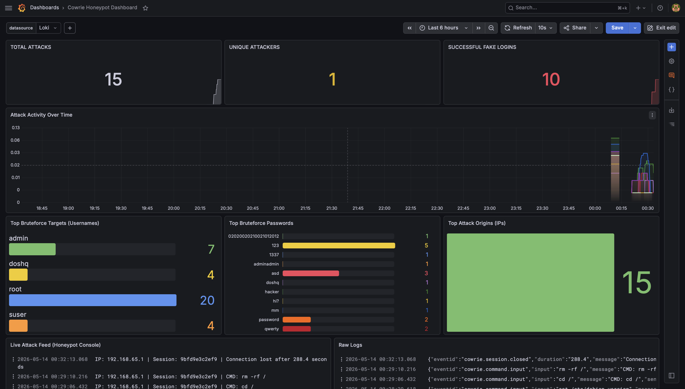
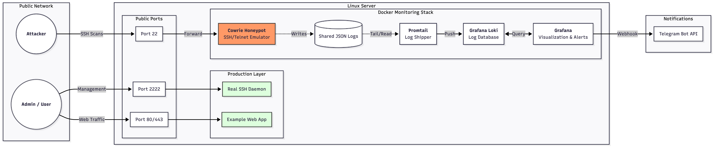
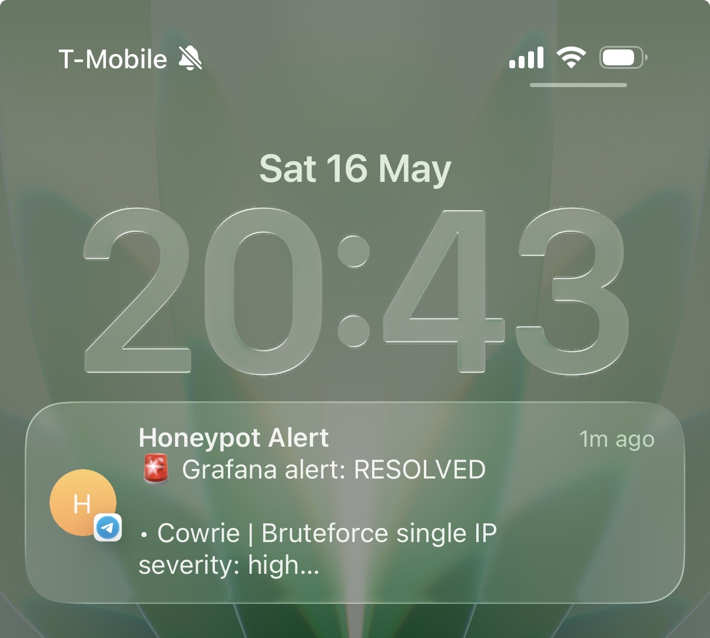

# Honeypot Monitoring & Alerting Stack

This project provides a complete, containerized stack for running a honeypot, collecting its logs, visualizing activity, and sending real-time alerts to Telegram.

## Grafana Dashboard Overview



## Main Components

The infrastructure is orchestrated using Docker Compose (located in the `dashboard/` directory) and consists of the following services:

- **[Cowrie](https://github.com/cowrie/cowrie):** A medium-to-high interaction SSH and Telnet honeypot designed to log brute force attacks and the shell interactions performed by the attacker.
- **[Promtail](https://grafana.com/docs/loki/latest/clients/promtail/):** A log shipping agent that tails Cowrie's JSON logs and forwards them to Loki.
- **[Loki](https://grafana.com/oss/loki/):** A highly available, multi-tenant log aggregation system optimized for storing and querying logs.
- **[Grafana](https://grafana.com/):** The analytics and interactive visualization web application. It connects to Loki to display honeypot activity dashboards and evaluates LogQL-based alert rules.
- **[Alert API](./dashboard/alert-api/README.md):** A custom Node.js service (`alert-api`) that receives webhook alerts from Grafana, deduplicates them, and forwards formatted notifications to Telegram.
- **Test Server:** A separate utility (`test-server`) for local mock testing.

## Architecture



## How to Run Locally

### Prerequisites
- **Git** installed to clone the repository.
- **Docker** and **Docker Compose** installed on your system.
- A **Telegram Bot Token** and **Chat ID** (for setting up the Alert API).

### 1. Clone the Repository

```bash
git clone https://github.com/musyata/honeypot/
cd honeypot
```

### 2. Configure the Alert API

Before starting the stack, you need to configure the `alert-api` service so it can communicate with Telegram.

Telegram Bot Alerting example:


```bash
cp dashboard/alert-api/.env.example dashboard/alert-api/.env
```
Edit the `dashboard/alert-api/.env` file and fill in your details:
- `TELEGRAM_BOT_TOKEN`: Your bot token from @BotFather.
- `TELEGRAM_CHAT_IDS`: The chat ID(s) where alerts should be sent.
- `ALERT_API_KEY`: A secret key you define to secure the webhook endpoint.

*For detailed instructions on configuring the Telegram bot and Grafana contact points, please refer to the [Alert API README](./dashboard/alert-api/README.md).*

### 3. Start the Stack

Navigate to the `dashboard/` directory where the `docker-compose.yaml` is located and start the services in detached mode:

```bash
cd dashboard/
docker compose up -d --build
```

### 4. Accessing the Services

Once the containers are up and running, you can access the following endpoints:

- **Grafana Dashboard:** [http://localhost:3000](http://localhost:3000) (Credentials: check your Grafana config/defaults)
- **Cowrie Honeypot:** SSH on port `2222` and Telnet on port `2223`.
- **Alert API Health Check:** [http://localhost:8081/health](http://localhost:8081/health)

## Project Structure

```text
├── dashboard/
│   ├── docker-compose.yaml     # Main infrastructure configuration
│   ├── promtail-config.yaml    # Promtail log routing rules
│   ├── alert-api/              # Telegram webhook forwarder source & Dockerfile
│   │   └── README.md           # Alert API documentation
│   └── grafana/                # Grafana provisioning (dashboards & datasources)
├── test-server/                # Test mock server
└── README.md                   # This file
```

## Alerts & Dashboards

Grafana is pre-provisioned with dashboards to visualize Cowrie metrics. The alerting rules are designed to detect:
- Failed login bursts
- Single IP bruteforce
- Password spraying
- Distributed scans
- Connection floods
- Suspicious command executions (e.g., `wget`, `curl`, `bash -i`)
- Successful logins (Critical)

For more information on the exact LogQL queries and scenarios, see the [Alert API Scenarios](./dashboard/alert-api/README.md#alert-scenarios-real-cowrie-rules--labels).

## Troubleshooting

- Mock-server logs does not display in Grafana?
Please follow the instruction in end of [promtail-config.yaml](./dashboard/promtail-config.yaml).

- Cowrie works, but logs does not update in Grafana?
Try to create cowrie.json file with writing permissions by own in `./dashboard/logs/cowrie/`

Does not find answer on your question? - Open new bug issue with details, we will solve it. 